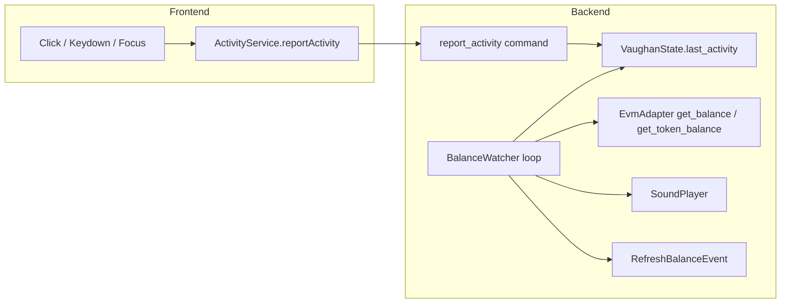

# Balance Polling (Activity-Based Watcher)

This document describes how the background balance checker works so it can be rebuilt or modified if needed.

## Overview

A background task in the Tauri backend polls the **focused** asset (native token or a specific custom token) for balance changes. When an **incoming** increase is detected, it:

1. Plays a sound alert (`CoinDrop`)
2. Emits a typed event so the UI can refresh displayed balances

Polling interval is **activity-based**: fast (3s) when the user is active, then 5s → 10s → 30s as idle time increases. This keeps alerts responsive without hammering the RPC when the app is idle.

## Architecture

## Backend (Rust)

### State

- **File:** `src-tauri/src/state.rs`
- **Field:** `VaughanState.last_activity: Mutex<Instant>`
- Initialized to `Instant::now()` in `VaughanState::new()` so the app starts in “active” mode (3s polling).

### Command

- **File:** `src-tauri/src/commands/wallet.rs`
- **Command:** `report_activity`
- **Behavior:** Sets `*state.last_activity.lock().await = std::time::Instant::now()`.
- **Registration:** Included in `collect_commands![]` in `src-tauri/src/lib.rs`.

### Balance watcher

- **File:** `src-tauri/src/monitoring/balance_watcher.rs`
- **Entry:** `balance_watcher::spawn(app_handle)` is called from `lib.rs` during app setup.
- **Loop:**
  1. Sleep for the current `sleep_duration` (starts at 3s).
  2. If wallet is locked or no active account/adapter, skip and continue.
  3. If account or chain changed, reset baseline balances.
  4. Read `focused_asset` from state (`"native"` or a token address). Defaults to `"native"` if unset.
  5. **Native:** call `adapter.get_balance(account)` and compare to previous value. **Token:** call `adapter.get_token_balance(token_addr, account)` and compare.
  6. If current balance **greater** than previous: play `CoinDrop`, log, emit `RefreshBalanceEvent`.
  7. Compute next `sleep_duration` from `last_activity.elapsed()`:
     - &lt; 2 min → 3s  
     - 2–5 min → 5s  
     - 5–10 min → 10s  
     - &gt; 10 min → 30s  

Constants in the watcher:

- `ACTIVE_SECS = 120` (2 min)
- `IDLE_MED_SECS = 300` (5 min)
- `IDLE_LONG_SECS = 600` (10 min)

### Event

- **Type:** `RefreshBalanceEvent` (in `balance_watcher.rs`), derived with `tauri_specta::Event`.
- **Emission:** `RefreshBalanceEvent.emit(&app_handle)` after detecting an incoming balance increase.
- **Frontend:** Typed listener via generated bindings, e.g. `events.refreshBalanceEvent.listen(...)`.

## Frontend

### Activity reporting

- **File:** `web/src/services/tauri.ts`
- **Service:** `ActivityService.reportActivity()` — calls `commands.reportActivity()` and ignores errors (e.g. when backend not ready).

- **File:** `web/src/App.tsx`
- **Setup:** A `useEffect` (empty deps) adds `window` listeners for `click`, `keydown`, and `focus`, each calling `ActivityService.reportActivity()`. The same effect removes the listeners on unmount.

So any click, key press, or window focus in the app triggers `report_activity` and keeps the backend in the “active” 3s polling tier until the user goes idle.

### Focused asset

The UI sets which asset is watched (native vs a token) via:

- **Command:** `set_focused_asset(asset: string)` — `"native"` or token contract address.
- **Service:** `WalletService.setFocusedAsset(asset)` in `tauri.ts`.

The token selector (or equivalent) should call this when the user focuses a token so the watcher polls that token’s balance instead of native.

### Refresh on event

Dashboard (or the view that shows balances) subscribes to the typed `refreshBalanceEvent` and invalidates/refetches balance queries so the UI updates right after the watcher detects an incoming transfer and plays the sound.

## Rebuild checklist

If you need to reimplement or move this feature:

1. **State:** Add `last_activity: Mutex<Instant>` to `VaughanState`, init to `Instant::now()` in `new()`.
2. **Command:** Add `report_activity` in `commands/wallet.rs` updating `last_activity`, and register it in `lib.rs` `collect_commands![]`.
3. **Watcher:** In `monitoring/balance_watcher.rs`, after each loop iteration, read `last_activity`, compute `elapsed`, set `sleep_duration` from the 3/5/10/30s tiers; use `focused_asset` to decide between native and token balance fetch; on increase, play sound and emit `RefreshBalanceEvent`.
4. **Events:** Ensure the tauri-specta builder mounts events (`mount_events`) so `RefreshBalanceEvent.emit` works.
5. **Bindings:** Run `npm run gen:bindings` so the frontend has `commands.reportActivity` and the typed event.
6. **Frontend:** Expose `ActivityService.reportActivity()` in `tauri.ts`; in `App.tsx` add a `useEffect` that subscribes `window` to `click`, `keydown`, `focus` and calls `ActivityService.reportActivity()` with cleanup.
7. **Focus:** Ensure the UI calls `set_focused_asset` when the user selects native or a token so the watcher polls the correct asset.

## Files reference

| Layer    | File | Relevant pieces |
|----------|------|------------------|
| Backend | `src-tauri/src/state.rs` | `last_activity: Mutex<Instant>` |
| Backend | `src-tauri/src/commands/wallet.rs` | `report_activity`, `set_focused_asset` |
| Backend | `src-tauri/src/monitoring/balance_watcher.rs` | `spawn`, loop, intervals, `RefreshBalanceEvent` |
| Backend | `src-tauri/src/lib.rs` | `collect_commands![]` (report_activity), `balance_watcher::spawn`, event mounting |
| Frontend | `web/src/services/tauri.ts` | `ActivityService.reportActivity`, `WalletService.setFocusedAsset` |
| Frontend | `web/src/App.tsx` | `useEffect` with click/keydown/focus → `ActivityService.reportActivity()` |
| Frontend | `web/src/bindings/tauri-commands.ts` | Generated: `reportActivity`, `setFocusedAsset`, events |
